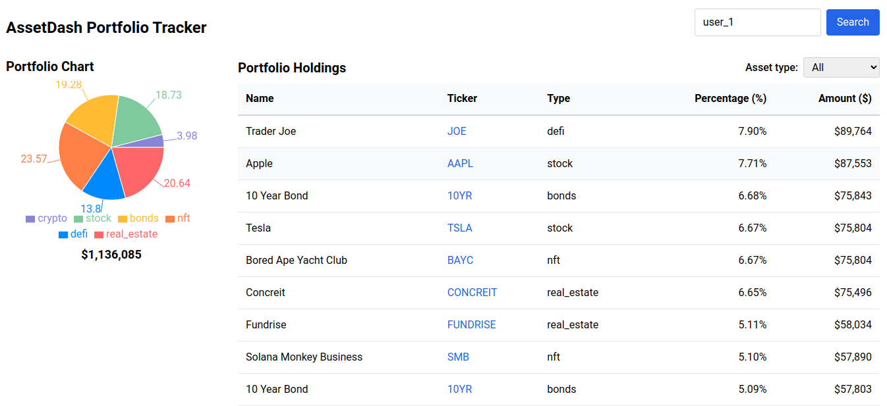

# AssetDash Full-stack Take-home

This repository demonstrates a simple full-stack setup using **FastAPI** for the backend and **React** (with **Tailwind CSS**) for the frontend. It implements two primary features for managing portfolio data:

1. **Portfolio Chart**  
2. **Portfolio Holdings**

---

## 1. Overview

### Backend

- Built with **FastAPI** (`server.py`).
- Two main endpoints:
  1. `GET /portfolio-chart`
     - Query param: `user_id`
     - Returns total portfolio value and a pie chart breakdown of each asset type in the user's portfolio.
  2. `GET /portfolio-holdings`
     - Query params: `user_id`, optionally `asset_type`
     - Returns a descending-value list of holdings, each with `ticker`, `name`, `type`, `value`, and `percentage`.

### Frontend

- Created with **Create React App**.
- Uses **Tailwind CSS** for styling and **Recharts** for charting.
- Main features:
  1. **Search bar** for `User ID`.
  2. **Portfolio Chart** (pie chart).
  3. **Portfolio Holdings** (table).
  4. **Dropdown** to filter by asset type.

### Key Change

In `database.py`, the **asset types** for bond items were labeled as `"bonds"` instead of `"bond"`. Originally, `ASSET_TYPES` contained `"bond"` but the data used `"bonds"`.


## 2. How to Run

### 2.1 Backend

#### Python Version

Ensure you are using Python 3.10 or 3.11 (the project is tested under Python 3.10).

#### Install Dependencies


```bash
cd backend

pip install -r requirements.txt
```

Run the Server

```bash
python server.py
```

The server starts at http://0.0.0.0:5000 by default.

2.2 Frontend
Install Node Dependencies
If your frontend is in a frontend folder:

```bash
cd frontend
npm install
```

Start the React App

```bash
npm start
```

The React app will be served at http://localhost:3000.

Enter a user ID (e.g., user_1) in the search bar, then click Search.
You should see a pie chart representing the portfolio’s asset-type breakdown and a table of holdings.
Use the dropdown to filter holdings by asset type (e.g., “bonds”, “crypto”, etc.).

# Screenshot:


